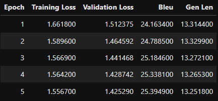

## Report about final solution

The final solution is chosen to be fine-tuning the t5-small transformer on the dataset provided.\
As a metrics I used BLEU and gen_len\
The model was trained for 5 epochs in 6 hours with batch size = 16, lr = 0.00002.\
The final score of BLEU I achieves is 25.39.\
Of course the BLEU is not perfect metric, since it cannot properly evaluate the sentences with exact meanings but different words.Only human can...\
Here are the metrics during training:\

